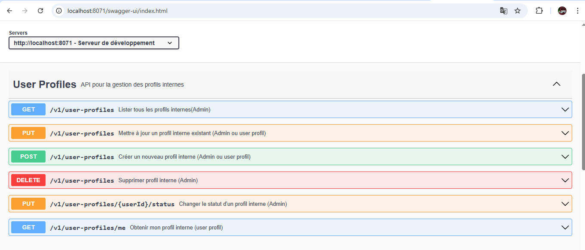
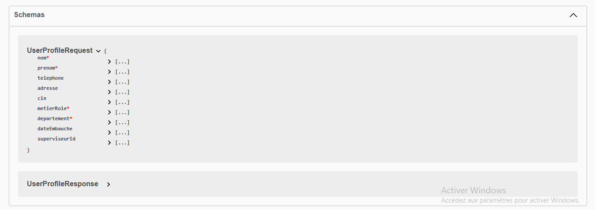
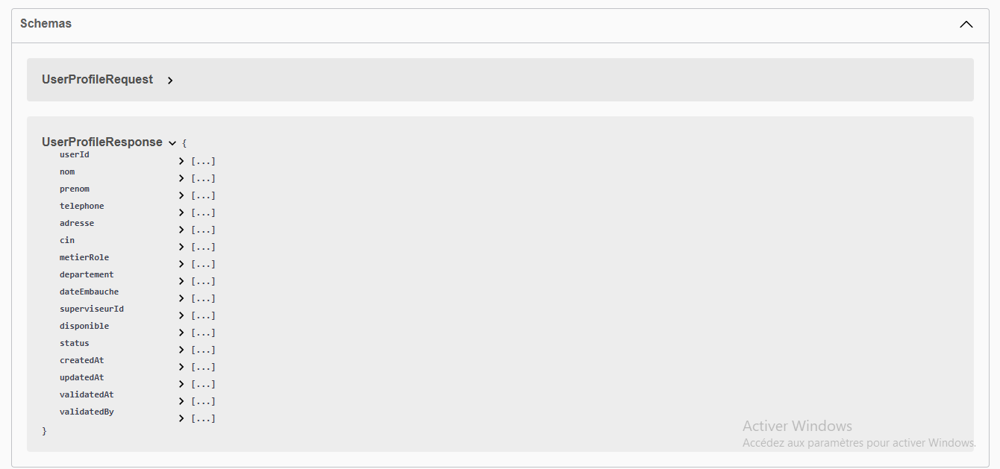

# Microservice_Interne

Ce projet est un **microservice Spring Boot** pour la gestion des profils internes des utilisateurs.
Il utilise **Spring Security avec JWT** pour l'authentification et la sécurisation des endpoints,
et **Swagger UI** pour la documentation API.

---

## Fonctionnalités

- Création, mise à jour et suppression des profils internes.
- Consultation des profils utilisateurs.
- Validation ou rejet des profils par un administrateur.
- Sécurisation des endpoints via JWT.

---

## 🛠️ Outils utilisés

- Java 17
- Spring Boot
- Spring Security
- Hibernate / JPA
- MySQL
- Maven
- Swagger (OpenAPI)
- Lombok

---

## ⚙️ Installation et configuration

### 1. Cloner le projet
```bash
git clone ttps://github.com/SalwaElghailani1/Projet_Microservice_Interne.git
cd Service Interne
```
### 2. Démarrer MySQL


### 3. Lancer l'application
```bash
mvn spring-boot:run
```
## Page d'Accueil Swagger




## Tests
Pour tester le microservice :
- Accédez à Swagger : http://localhost:8071/swagger-ui/index.html
- Authentifiez-vous avec admin@example.com/admin123
- Copiez le token JWT
- Cliquez sur "Authorize" en haut et collez Bearer <votre-token>
- Testez tous les endpoints sécurisés

